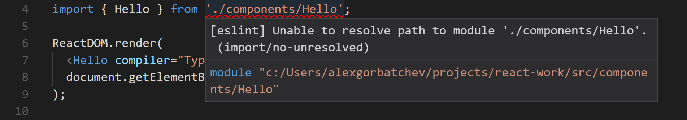

# eslint-import-resolver-typescript

This plugin allows you to use `eslint-plugin-import` with `.ts` and `.tsx` files.



## Installation

```
npm install --save-dev eslint-import-resolver-typescript
```

Add the following to your eslint config:

```
"settings": {
  "import/resolver": {
    "node": true,
    "eslint-import-resolver-typescript": true
  }
}
```

